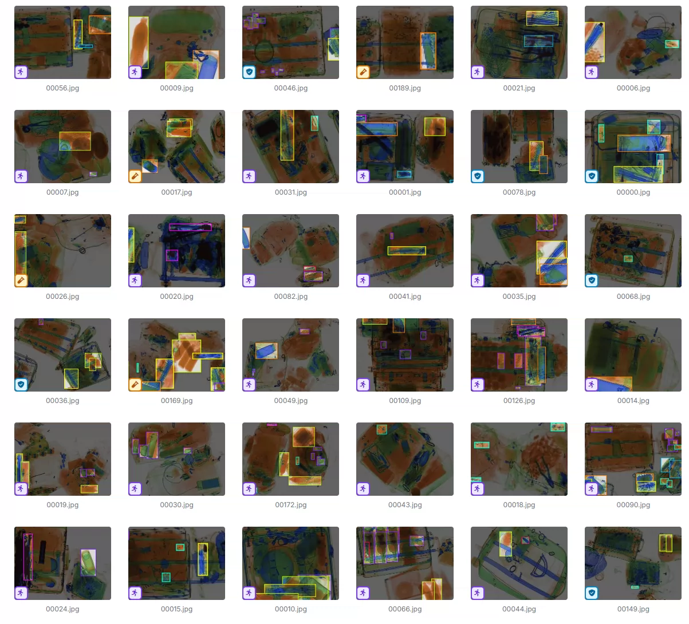
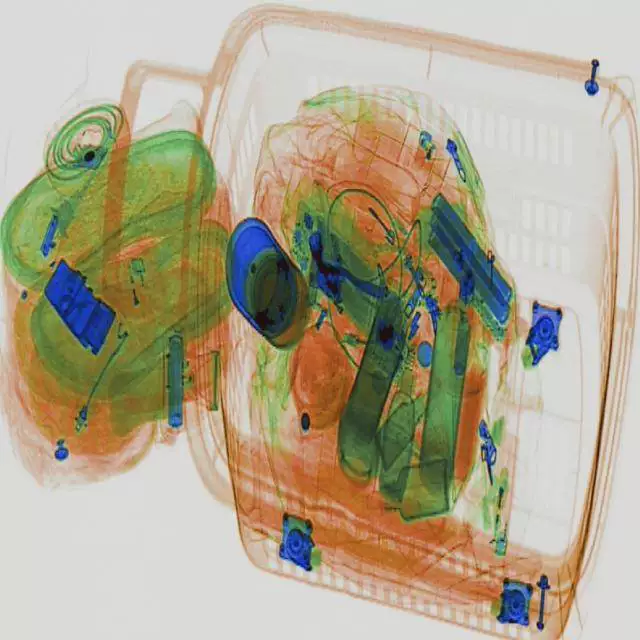
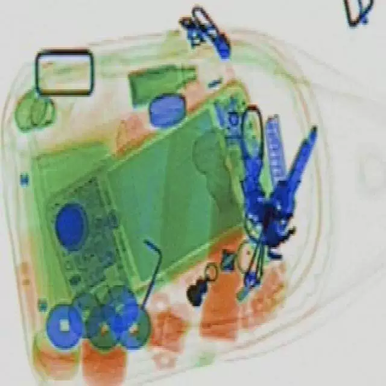
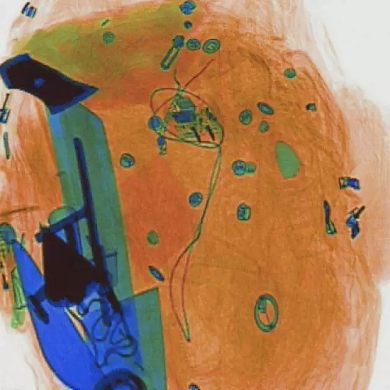

## Body

X-ray安检数据集  Detection of Objects

A total of 5,000 images are available, each labeled appropriately. The dataset is divided into 8 categories: 'drinkbottle', 'glassbottle', 'knife', 'lighter', 'metalcup', 'powerbank', 'umbrella', 'wrench'.

The labels include 'drinkbottle', 'glassbottle', 'knife', 'lighter', 'metalcup', 'powerbank', 'umbrella', 'wrench'.

Electronic virtual products sold on this platform are not eligible for returns or exchanges.

## Images

Here is a pay link on Stripe ( https://buy.stripe.com/3cs8yP7sY87d0vu9AB ). Please contact me lonlonago@foxmail.com after funding $89, and I will send you a complete data files , thank you!

